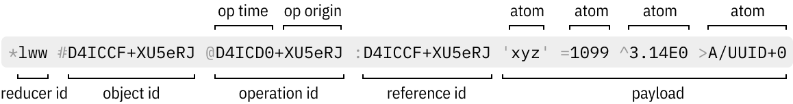

# Operations

Operations are the smallest atomic unit of RON protocol. Everything else is made of ops, including logs, object state, patches, chains, chunks, frames etc.

## Closed notation

In its fullest form, operation is four UUIDs and zero or more atoms in payload:

In RON Each UUID is marked with prefix denoting its type:

- `*` starts a reducer id (a *name* variety UUID from a pre-defined list),
- `#` starts an object id this operation is applied to,
- `@` starts an operation id, unique for every created operation,
- `:` starts a reference operation id. Swarm uses it to track causality relationships. Usually it’ll be a last operation replica has seen on particular object.

Payload is a space-separated list of zero or more atoms. Payloads are reducer-specific. Different reducers will expect different atoms in different order.

The example above corresponds roughly to the following JSON:

    { reducer_id:   "lww",
      object_id:    "D4ICD0+XU5eRJ",
      operation_id: "D4ICD0+XU5eRJ",
      reference_id: "D4ICCF+XU5eRJ",
      payload:      ["xyz", 1099, 3.14, "A/UUID+0"] }

## Open notation

Open notation is just a shorted version of closed one. Reducer id and object id are omitted in this case, as those could be deduced from full DB and reference id:

## Op patterns

An UUID may be one of four *versions*: event, derived, name and hash. Consequently, an op may have one of 16 *patterns*, depending on the versions of its *id* and *reference*. Used patterns are:

/li

- **++** a regular op, like a letter typed in a text or a field in a key-value object
- **-+** deletion, reverts the referenced op
- **--** undeletion, reverts earlier deletion(s) of the referenced op
- **+$** creation, creates an object, serves as its causal root op
- **+-** acknowledgement (an ack), not part of the referenced causal tree, used for versioning
- **$+ $-** annotation, not part of the data model, e.g. a comment or an error message or some derived calculation (like a cryptographic hash of an op)

    @~ 'this is a projection, namely a sha3-512 Merkle hash of the op'
    @sha3 :D4ICD-XU5eRJ '2b158f60983baaa9041e9edf85cd727070f0ff030fc7c1b433aafdd83f4e30ea'