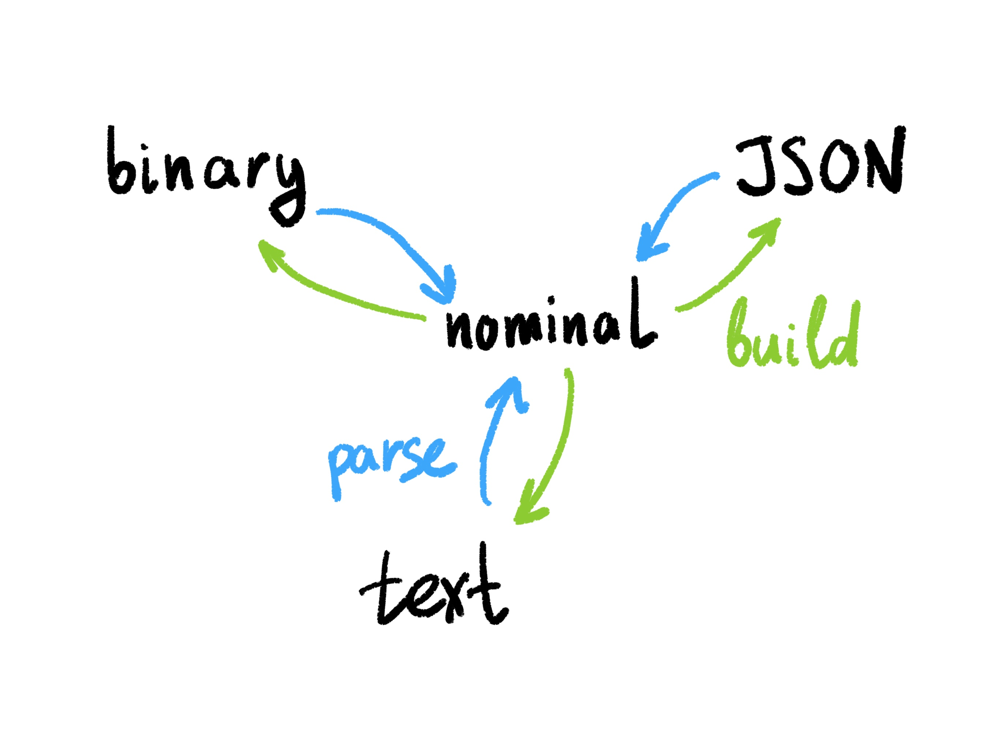

# RON Specification

# Serialization

There are four different ways to represent RON structures:

1. *Textual* is good for human-friendly output, commands, queries and debugging.
2. *Nominal* is for internal representation in-memory.
3. *Binary* is for machine-to-machine communication and persistence.
4. *JSON/CBOR* is for systems where efficient parsers of JSON exist.

## Textual

[Atoms: integers, floats, strings](./Atoms-integers-floats-strings-8c01b6a4-6ad6-4a84-88f2-7708aa5fca3a.md)

[Operations](./Operations-b812fb09-b8e1-4d84-a8bd-1f794dfccee2.md)

[Frames](./Frames-cdf9bc1e-f697-4ac8-8a61-f41ef2d41325.md)

## Nominal

[Nominal format](./Nominal-format-6fb7c29d-ad2c-429f-b183-0d7a88f3ba2b.md)

## Binary

[Binary format](./Binary-format-10b5c95c-b9ec-4a7b-ae54-b0b3c8b9b9d8.md)

## JSON/CBOR

[JSON/CBOR](./JSON-CBOR-ca5fb2ee-2944-4554-a707-cf62910718f7.md)

# Communication protocol

[Transactional/atomic changes](./Transactional-atomic-changes-2d3fa04f-f71f-4655-8331-b6405ef18478.md)

[Network protocol](./Network-protocol-3fe96190-99b3-4e0b-928e-78e2ba18922e.md)