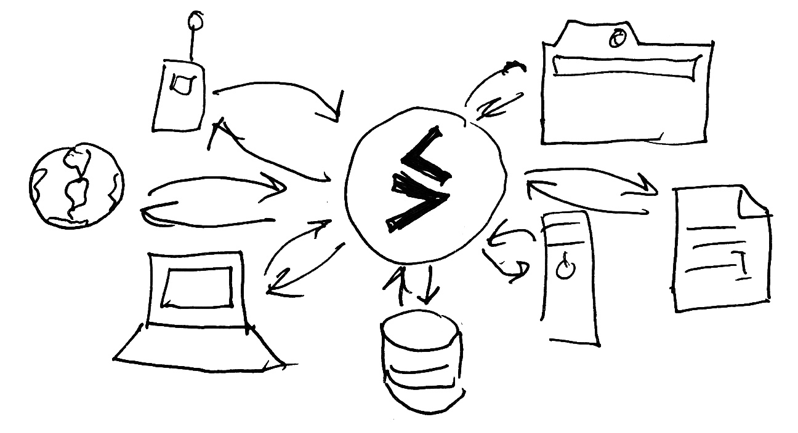

# Swarm DB

Swarm is a distributed, offline-ready reactive KV storage with eventual consistency and automatic conflict resolution. Think Git but for your entire database.

# What does Swarm do?

Swarm solves for you the hard problem of reliable and efficient data synchronization between multiple parties in a complex topologies. You hand your data to local Swarm instance and Swarm ensures it gets propagated to all interested parties. Swarm easily scales up to multitude of replicas and sessions, spanning to browsers, mobile devices and multi-region server deployments.

Swarm also spends extra effort to guarantee data conflicts are resolved in a predictable, controllabe way. Even in a presence of concurrent writers and intermittent/offline network connections. Your data is always safe and where in needs to be, delivered just in time.

# What is Swarm good for?

Many things:

- reactive database,
- collaborative text editing,
- distributed version control,
- decentralized Web,
- geo-distributed eventually consistent data store,
- shared database run by multiple parties (e.g. a [two-sided market](http://lexicon.ft.com/Term?term=two_sided-markets) data exchange),
- [super-peer network](http://ilpubs.stanford.edu:8090/594/1/2003-33.pdf).

# How does Swamr works?

[Storage](./Storage-c9f002de-73c5-4700-aebe-78345253bff7.md)

RocksDB-based database server, persistent storage and peer.

[Application layer](./Application-layer-9a55f0b6-21e3-43a7-afb2-292692a6cf3c.md)