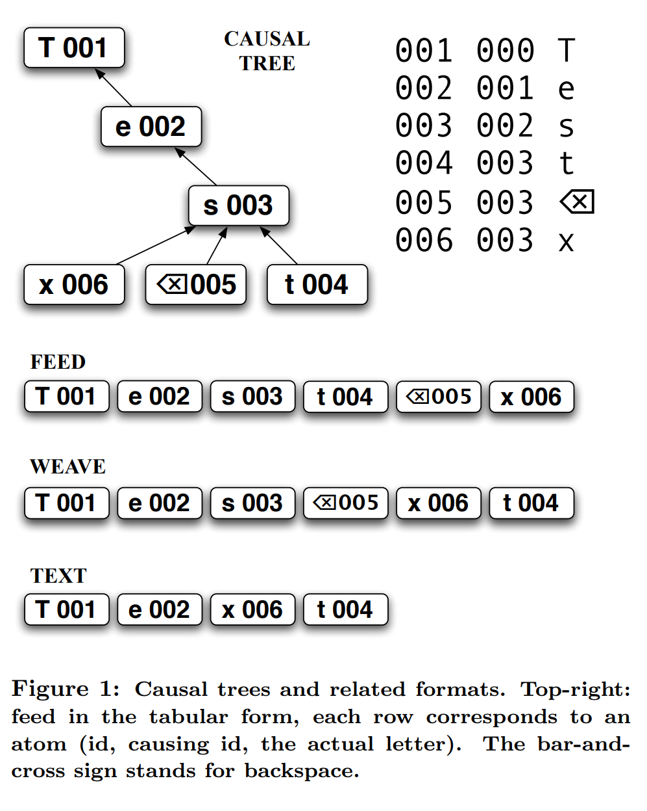
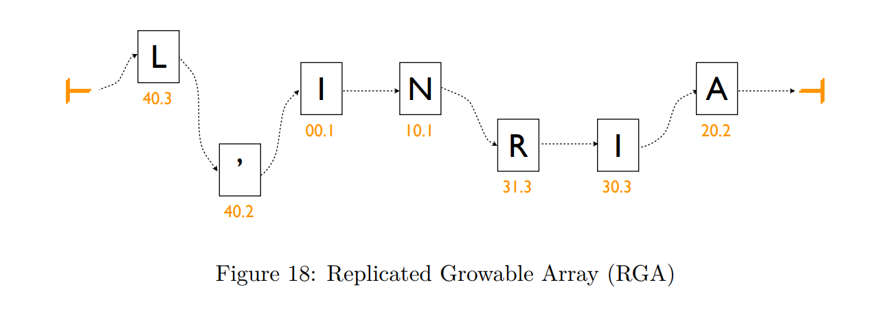

# RGA/CT: Replicated Growable Array / Causal Tree

[RGA/CT](http://csl.skku.edu/papers/jpdc11.pdf) is a CRDT data type for ordered
collections (arrays, vectors, plain text).  Overall, RON 2.1 RGA/CT follows the
classic RGA/CT data structure:

* a tree of atoms/ops (for plain text, one letter - one op),
* a new atom becomes a child of its preceding atom at the time of insertion,
* siblings are ordered by the logical timestamp (younger first).

 

For RGA/CT inner workings, Fig.1 from the [original 2008 CT
paper](http://citeseerx.ist.psu.edu/viewdoc/download?doi=10.1.1.627.5286&rep=rep1&type=pdf)
is still a valid illustration today.  Similarly, Fig. 18 from the [2011 INRIA
paper](https://hal.inria.fr/inria-00555588/document) shows how RGA/CT works in
its flattened form.

 

The 2.1 implementation continues the [CT
line](http://www.st.ewi.tudelft.nl/victor/articles/ctre.pdf) of algorithms and
not [RGA](https://t.co/xVxyNRFs3E).  Namely, RON 2.1 RGA/CT applies changes by
parallel iteration of inputs (aka RON frame reduction).  A similar method is
used by
[Cassandra](https://github.com/apache/cassandra/blob/trunk/src/java/org/apache/cassandra/utils/MergeIterator.java)
and other databases. Changes are batched as much as possible.  The reason for
this behavior is to avoid the overhead of maintaining reference-based
datastructures (trees, linked lists, etc).  Instead, CT uses sequential access
and flat datastructures as much as possible.  Even in C++, maintaining a tree
is plenty of overhead.  In higher-level languages (think Java/JavaScript) a
tree may consume 100x more RAM than a flat buffer. A linked list is considered
a worst-case datastructure for a garbage collector. Hence, flat buffers and
sequential access.

The RON 2.0 RGA/CT variant is the closest to 2.1, albeit there are
significant differences in handling deletes and undeletes (see below).  Also,
RON 2.1 ops are strictly immutable (because crypto), which is different from
RGA/CT 2.0. The old version collapsed deletions into deleted ops.

## Delete/undelete

2.1 delete/undeletes are backward-compatible; a detetion op might be attached
to the deleted letter/atom/op, thus creating a tombstone. The deleted atom retains its position
and id, so any concurrently created ops will not lose their attachment point.

Those delete/undelete ops allow to implement undo/redo. Undo of insertion
is deletion, undo of deletion is undeletion. As a letter must retain its id
after it was undeleted, we use undeletion and not repeat insertion.

The new 2.1 feature is chained deletions.  RON 2.1 relies on op
[chains](/specs/glossary) a lot: it employs chain-based compression, hash
calculations are easier with chains, swarmdb storage model is chain-based.
With RGA/CT, continuously inserted text naturally becomes a chain, hence all
these optimizations work for insertions. Unfortunately, "old" RGA/CT deletions break
this pattern. Deletes are interleaved with the deleted letters, hence all the
optimizations break (other optimizations may work here, but those are not as
good as those chain-based).

2.1 chained deletions work as follows: a chain of deletes might be attached to
any letter; the first deletion will delete the root letter (as before), the
next one targets the root's causal parent, the next affects the grandparent and
so on.  Similarly, chains of undeletions get attached to deletions and affect
the root, then the parent, then the grandparent deletion and so on.

In a sense, a deletion acts like it is a backspace symbol. Two backspaces - two
symbols deleted. Although, that does not generalize that easily to
deletion/undeletion trees. As a regular insertion can not be attached to
a deletion or undeletion, the only complex case is a mixed deletion/undeletion
tree attached to a single root insertion. Such a tree generates a stripe-y
delete/keep chain pattern that gets applied to the root's parent-grandparent
chain.

Let's consider an example.
Suppose, a user typed "abcd" then pressed backspace three times, then
undid two deletions out of three. What we'll have is a chain where
each op is caused by the previous one:
`a b c d < < < > >`

The RON rendering for the chain might look like:
<pre>
  1 @1hMDg6+gYpLcnUnF6 :rga !
  2     &apos;a&apos;,
  3     &apos;b&apos;,
  4     &apos;c&apos;,
  5     &apos;d&apos;,
  6 @1hMDg60005+gYpLcnUnF6
  7     <u style="text-decoration-style:single">rm</u>,
  8     <u style="text-decoration-style:single">rm</u>,
  9     <u style="text-decoration-style:single">rm</u>,
 10 @1hMDg60008+gYpLcnUnF6
 11     <u style="text-decoration-style:single">un</u>,
 12     <u style="text-decoration-style:single">un</u>,
</pre>

If using the RON span notation:

<pre>
  1 @1hMDg6+gYpLcnUnF6 :rga ! (&apos;abcd&apos; 4), <u style="text-decoration-style:single">rm</u> (3), <u style="text-decoration-style:single">un</u> (2),
</pre>

The resulting text should be `abc`.

With the tree mostly consisting of chains, the overhead of the op-based
approach, such as per-symbol metadata, mostly goes away.  That is easier to
achieve in non-real-time systems, as patches would naturally form spans (chains
with incremental numbering) that compress extremely well (no need to mention
every individual operation).  

Also, with the new approach, deletions/undeletions become regular ops in the
causal tree, not a special case at all.  That simplifies reducers dramatically
(compared even to RON 2.0) As a downside, the mapper (i.e. the function
producing the plain text) becomes more complex, as the effect of deletions
becomes less local.

## Read next

...

