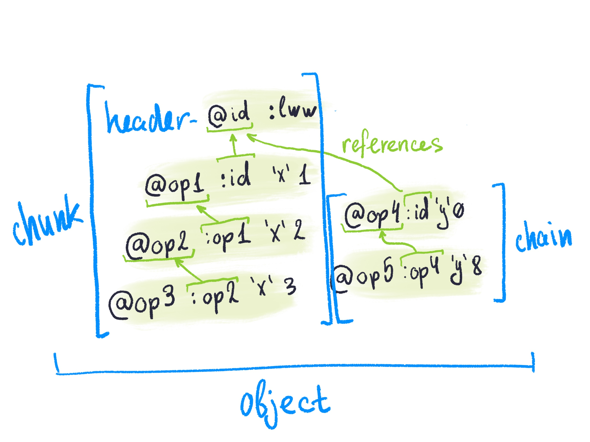

# Frames

Frame is a sequence of operations (e.g. object state is a frame, patch is a frame etc).

Ops in a frame always travel together.

Frames can’t be split (but they can be joined together).

Frames end with dot `.`.

## Raw frame

Raw frame is just a group of operations client sends to the peer. It contains delta, or patch — list of changes that client wants to be applied.

Syntax:

- Raw frame is just a list of ops.
- Each op ends with a `;` (raw operation).
- Frame ends with a dot `.`.

```
@1D4ICCC+XU5eRJ :1D4ICCA+XU5eRJ 'y' 'A';
@1D4ICCA+XU5eRJ :lww;
@1D4ICCB+XU5eRJ :1D4ICCA+XU5eRJ 'x' 1;
.
```

## Reduced frame

Reduced frames are how state is stored internally in SwarmDB. They contain state: object creation and all the opeartions that follow it, sorted in linear order.

Syntax:

- Reduced frame consists of one or more chunks.
- Each chunk has a header (object creation op ending with `!`).
- Header is followed by zero or more operations on the same object (ending with `,`).
- Reduced frame still ends with `.`.

Here are two chunks in a single frame:

```
@1D4ICCA+XU5eRJ :lww!
@1D4ICCB+XU5eRJ :1D4ICCA+XU5eRJ 'x' 1,
@1D4ICCC+XU5eRJ :1D4ICCB+XU5eRJ 'y' 'A',
@1D4IDD0+XU5eRJ :lww!
@1D4IDD1+XU5eRJ :1D4IDD0+XU5eRJ 'a' 3.14159,
@1D4IDD2+XU5eRJ :1D4IDD0+XU5eRJ 'b' 'Y',
.
```

Minimal frame would consist of just a header:

```
    @1D4ICCA+XU5eRJ :lww!.
```

## Compression

Operations in frames could be compressed by omitting repeating UUIDs of matching types. E.g. if object id of an operation matches object id on the previous op, we can just skip it. This is purely mechanical compression that carries no semantic.

```
*lww #1D4ICCA+XU5eRJ @1D4ICCA+XU5eRJ :lww!
*lww #1D4ICCA+XU5eRJ @1D4ICCB+XU5eRJ :1D4ICCA+XU5eRJ 'x' 1,
*lww #1D4ICCA+XU5eRJ @1D4ICCC+XU5eRJ :1D4ICCB+XU5eRJ 'y' 'A',
*lww #1D4IDD0+XU5eRJ @1D4IDD0+XU5eRJ :lww!
*lww #1D4IDD0+XU5eRJ @1D4IDD1+XU5eRJ :1D4IDD0+XU5eRJ 'a' 3.14159,
*lww #1D4IDD0+XU5eRJ @1D4IDD2+XU5eRJ :1D4IDD0+XU5eRJ 'b' 'Y',.
```

As we see, all reducer UUIDs are the same, so we can only specify it on the first operation:

```
*lww #1D4ICCA+XU5eRJ @1D4ICCA+XU5eRJ :lww!
     #1D4ICCA+XU5eRJ @1D4ICCB+XU5eRJ :1D4ICCA+XU5eRJ 'x' 1,
     #1D4ICCA+XU5eRJ @1D4ICCC+XU5eRJ :1D4ICCB+XU5eRJ 'y' 'A',
     #1D4IDD0+XU5eRJ @1D4IDD0+XU5eRJ :lww!
     #1D4IDD0+XU5eRJ @1D4IDD1+XU5eRJ :1D4IDD0+XU5eRJ 'a' 3.14159,
     #1D4IDD0+XU5eRJ @1D4IDD2+XU5eRJ :1D4IDD0+XU5eRJ 'b' 'Y',.
```

Object ids are the same on 1-3 and 4-6 operations. Removing redundant ones:

```
*lww #1D4ICCA+XU5eRJ @1D4ICCA+XU5eRJ :lww!
                     @1D4ICCB+XU5eRJ :1D4ICCA+XU5eRJ 'x' 1,
                     @1D4ICCC+XU5eRJ :1D4ICCB+XU5eRJ 'y' 'A',
     #1D4IDD0+XU5eRJ @1D4IDD0+XU5eRJ :lww!
                     @1D4IDD1+XU5eRJ :1D4IDD0+XU5eRJ 'a' 3.14159,
                     @1D4IDD2+XU5eRJ :1D4IDD0+XU5eRJ 'b' 'Y',.
```

Finally, as you can see, last two operations share the same reference id. Let’s drop last one:

```
*lww #1D4ICCA+XU5eRJ @1D4ICCA+XU5eRJ :lww!
                     @1D4ICCB+XU5eRJ :1D4ICCA+XU5eRJ 'x' 1,
                     @1D4ICCC+XU5eRJ :1D4ICCB+XU5eRJ 'y' 'A',
     #1D4IDD0+XU5eRJ @1D4IDD0+XU5eRJ :lww!
                     @1D4IDD1+XU5eRJ :1D4IDD0+XU5eRJ 'a' 3.14159,
                     @1D4IDD2+XU5eRJ                 'b' 'Y',.
```

With this simple technique we were able to reduce frame size by 30%.

## Frame substructures

Depending on how ops are grouped, following structures might be found inside frame:

*Chains* — sequences of consecutive ops from the same origin.

*Chunks* — groups of reduced ops; a chunk starts with a header op, has zero or more reduced ops; a chunk may contain op chains, but not the other way around.

*Yarn* — the log of all the operations from the same origin, in order.

*Object* — one RON object is a causal tree of ops, where the object creation op is the root; the tree edges are op *references*. An object may be cleaned of irrelevant historical ops (gc’d), thus the “clean” frame is not the complete tree, but likely a subset thereof.



## Read next

[Nominal format](../nominal/).