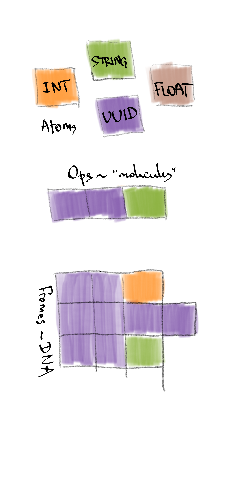

# RON term glossary

* RON UUID - a 128-bit globally unique identifier, one of four *versions*:
    * time-based (a logical/hybrid timestamp, 60 bits of timestamp, 60 bits of event *origin* id)
    * name (a human readable name of some predefined concept, e.g. a data type or an error type)
    * numeric (either an arbitrary number or a hash)
* Atom - an immutable value of one of four types:
    * RON UUID
    * Integer (64-bit signed)
    * String (UTF-8)
    * Floating-point number (IEEE 754-2008, 64 bit)
* Op - an immutable unit of change, consists of:
    * specifier (metadata)
        * own RON UUID (id, identifies the op)
        * reference RON UUID (ref, identifies the op's location in the data graph)
    * value (payload data)
        * any number (zero or more) of value atoms (UUIDs, ints, strings, floats)

If we compare RON atoms to real (chemistry) atoms, then RON ops are "molecules", composed of "atoms".
Then, an op log is our DNA - it contains all the replicated data.
Other higher-value constructs are like polypeptides, proteins and suchlike - they are composed of ops.
Fundamentally, they are either subsets or projections of the op log (the DNA).
A replicated op log is the foundation of all this machinery.

## Op-collection construct

* Yarn - a linear log of all ops from the same origin (corresponds to a Lamport process).
* Chain - a fragment of a yarn where each next op references the previous one.
* Span - (chain span) - a chain where each op's id is exactly an increment of the previous id (`1gABC+origin, 1gABC00001+origin, 1gABC00002+origin...`).
* Tree - a causally ordered group of ops forming a tree (each next op references some preceding op from the tree, except for the root op).
* Object - largely synonymous to a tree where the root references the data type (RDT).
* Object log - a causally ordered log of the object's ops.
* Object state - an RDT-ordered sequence of the object's ops (e.g. an RGA/CT text object will follow the text order). 
* Header - the object creation op (its id becomes the object's id; the header op is the root of the object's op tree).
* Patch - a group of ops modifying the same tree/object (causally consistent, i.e. referencing the tree or the patch ops).
* Frame - largely synonymous to a "write batch"; a group of ops to be applied atomically, in a single transaction.
* Chunk - a group of related ops within a frame, e.g. object state or a patch.
* Log - a causally ordered sequence of ops, like a database op log.
  While a separate yarn is linearly ordered (a Lamport process), a log of many yarns is partially ordered (distributed processes).
  Hence, different replicas of a log may go in slightly different orders while obeying causality.
* Graph - a group of objects referencing each other.
* Graph patch - a group of object patches and full object states, a causally consistent change of an object graph.

## Other terms

* Annotation - a pseudo-op that is not itself a data-event, but some ascribed information related to some op (e.g. a comment).
* Deriveds - pseudo-ops, a result of a pure-function derivation from the original data-event ops (e.g. the output of mappers).
* Local order - a de-facto linear order of a partially ordered datastructure, as observed on the local replica.
* Mapper - a stateless object converting (mapping) data between RON and external representations, e.g. plain text, CSV, JSON.
    Mappers may support full-state reads (e.g. provide plain text for an RGA object), updates (provide patches for the text),
    full state writes (accept plain text, generate RON ops) or partial writes (accept a patch, generate ops).

{:#vector-timestamp} Vector timestamp
: an array of time-based UUIDs, one per origin; a timestamp produced by vector clocks. 
