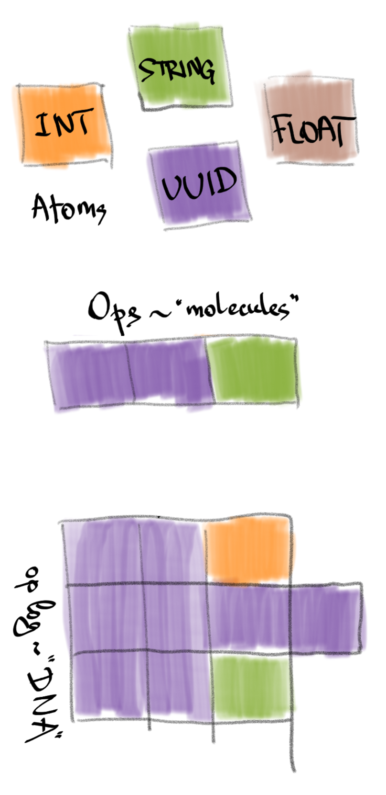

# RON term glossary

* RON UUID - a 128-bit globally unique identifier, one of four *versions*:
    * time-based (a logical/hybrid timestamp, 60 bits of timestamp, 60 bits of event *origin* id)
    * name (a human readable name of some predefined concept, e.g. a data type or an error type)
    * numeric (either a random number or a hash)
* Atom - an immutable value of one of four types:
    * RON UUID
    * Integer (64-bit signed)
    * String (UTF-8)
    * Floating-point number (IEEE 754-2008, 64 bit)
* Op - an immutable unit of change, consists of:
    * specifier (metadata)
        * own RON UUID (id, identifies the op)
        * reference RON UUID (ref, identifies the op's location in the data graph)
    * value (payload data)
        * any number (zero or more) of value atoms (UUIDs, ints, strings, floats)

If we compare RON atoms to real (chemistry) atoms, then RON ops are "molecules", composed of "atoms".
Then, an op log is our DNA - it contains all the replicated data.
Other higher-value constructs are like polypeptides, proteins and suchlike - they are composed of ops.
Fundamentally, they are either subsets or projections of the op log (the DNA).
A replicated op log is the foundation of all this machinery.

## Op-collection construct

* Chain - a sequence of ops from the same origin, where each next op references the previous one
* Span - (chain span) - a chain where each op's id is exactly an increment of the previous id (`1gABC+origin, 1gABC00001+origin, 1gABC00002+origin...`)
* Yarn - a linear log of all ops from the same origin (corresponds to a Lamport process)
* Tree - a causally ordered group of ops forming a tree (each next op references some preceding op from the tree, except for the root op)
* Object - largely synonymous to a tree, although op ordering depends on the data type (RDT)
* Header - the object creation op (its id becomes the object's id; the header op is the root of the object's op tree)
* Patch - a group of ops modifying the same tree/object (causally consistent, i.e. referencing the existing ops of the tree or previous ops of the patch)
* Frame - largely synonymous to a "write batch"; a group of ops to be applied atomically, in a single transaction
* Chunk - a group of object's ops, preceded by the object's header, e.g. object state or a patch
* Log - a causally ordered sequence of ops, like a database op log. While yarns are linearly ordered, a log only has partial (causal) order; different replicas of a log may go in slightly different orders.
* Graph - a group of objects referencing each other
* Graph patch - a group of object patches and full object states, a causally consistent change of an object graph
* Segments - a log segment, a yarn segment, a chain segment, etc etc - a subset of the construct retaining its key features

## Other terms

* Annotation - an pseudo-op that is not itself a data change, but some derived/secondary information, related to some op (e.g. its hash or other metadata).
* Vector timestamp - an array of time-based UUIDs, one per origin; a timestamp produced by vector clocks. 
