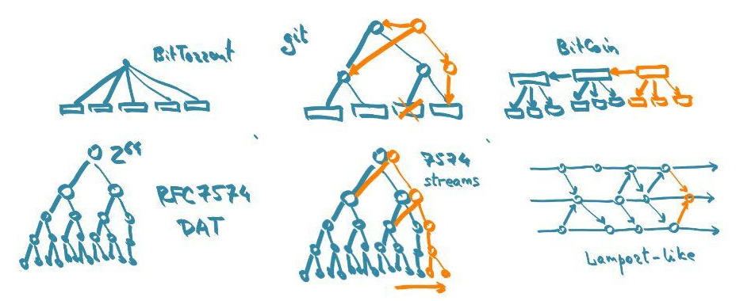

# Merkle hashing

Merkle hashing guarantees data integrity.
It is used extensively in numerous high-profile project: git, BitTorrent, BitCoin and others.
RON brings some new challenges.

The first one is efficiency.
RON ops are very fine grained pieces of data.
A RON op is likely to be smaller than its hash.
Hence, the hash overhead becomes a part of the bigger issue of metadata overhead.

The second challenge is the multitude of RON serializations.
A hash of a text frame would be different from the hash of the same frame in CBOR, etc.
Even within one serialization, there are various format options, such as whitespace and compression.
For that reason, RON Merkle structure is defined on the [nominal format](nominal/).
It mostly uses uncompressed 128-bit atoms, hence no optional elements.

Conveniently, the nominal format roughly matches the in-memory layout of a parsed op in compiled languages (e.g. C++, go, partially Java).
Although, we assume the nominal format with big-endian 64-bit words here.
That likely differs from the de-facto layout.

This spec defines the data which has to be fed to a hash function to produce the op hash.
It also defines the reuse of earlier hashes, thus defining a Merkle tree that matches the causal structure.

Key concerns of the algorithm are:
* Build a proper Merkle structure along the lines of the Lamport process/message graph.
* Ensure that different ops don't match to the same byte sequence and hence hash (mocking).
* Ensure any serialization of an op maps to the same hash.

## Specifier (op key)

The op's id and reference form the Merkle DAG structure of the op graph.
The hashing function is fed two UUID+hash pairs, as produced for earlier ops by the same function:
* a pair of the op's own id (128-bit UUID) and a hash of the immediate preceding op from the same origin (yarn-previous).
* a pair of the reference UUID and a hash of the referenced op.

This part has a size of `(16+HASHSIZE)*2` bytes, e.g. 96 bytes for any 32-byte hash function.

## Value

Value atoms are fed in the nominal representation: 128 bits per atom, values parsed, origin ranges cleared, all big-endian.
Effectively, the second word (origin) only contains the flags.
Supplying the flags is necessary to prevent mocking, e.g. picking an integer that matches some float in its bit layout, etc.
Effectively, UUIDs are fed as-is (two big-endian words).
Value UUIDs don't form Merkle links, unless explicitly accompanied by hashes.

The special case is strings, because:

1. They are arbitrary-length.
2. Unicode string serialization has some degrees of freedom, esp. the text representation that has escapes.
3. Mocking.

Thus, strings are fed as 128-bit atoms followed by arbitrary-length UTF-8 strings.
The atom has codepoint length and byte length values set, origin ranges cleared.
That is followed by the string itself, which must be a correct UTF-8 sequence of the specified byte/codepoint length.

