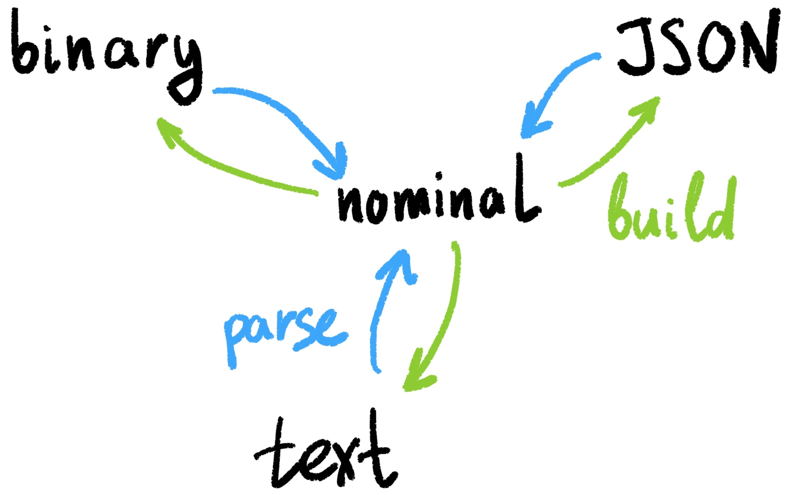

# RON Serialization

There are four different ways to represent RON structures:

1. *Textual* is good for human-friendly output, commands, queries and debugging. Specifications for:
  - [Atoms: integers, floats, strings](atoms/);
  - [Operations](ops/);
  - [Frames](frames/).
2. [*Nominal*](nominal/) is for internal representation in-memory.
3. [*Binary*](binary/) is for machine-to-machine communication and persistence.
4. [*JSON/CBOR*](json/) is for systems where efficient parsers of JSON exist.

# RON Communication protocol

[Transactional/atomic changes](changes/).

[Network protocol](network/).