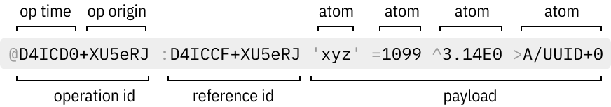

# Operations

An operation ("op") is the smallest transmissible unit within the RON protocol. Everything else is made of ops, including logs, object state, patches, chains, chunks, frames etc.

## Closed notation

In its full form, the op is four RON UUIDs, followed by zero or more atoms (the "payload"):


In RON, each UUID is marked with a prefix denoting its type:

- `*` starts a reducer id (a *name* variety UUID that comes from a pre-defined list),
- `#` starts an object id, i.e. the id of the object this operation is applied to,
- `@` starts an operation id, unique for every operation created,
- `:` starts a reference operation id. Swarm uses it to track causality relationships. Usually it’ll be the last operation a replica has seen of a particular object.

The payload is a space-separated list of zero or more atoms. Payloads are reducer-specific. Different reducers will expect different atoms in different order.

The example above corresponds roughly to the following JSON:

    { reducer_id:   "lww",
      object_id:    "D4ICCF+XU5eRJ",
      operation_id: "D4ICD0+XU5eRJ",
      reference_id: "D4ICCF+XU5eRJ",
      payload:      ["xyz", 1099, 3.14, "A/UUID+0"] }

## Open notation

Open notation is just a shortened version of the closed one. In this case, the reducer id and object id are omitted because they were able to be deduced from their context and other ops:



See [frame compression](/specs/frames#compression) for more information on open notation.

## Op patterns

A RON UUID may be one of four *versions*: event, derived, name, or hash (see [UUID Flag bit coding](/uuids#flag-bit-coding)). Consequently, an op may have one of 16 *patterns*, depending on the versions of its *id* and *reference*. RON defines following combinations:

<table>
  <thead>
  <tr>
    <th>Id ver</th>
    <th>Ref ver</th>
    <th>Meaning</th>
  </tr>
  </thead>
  <tbody>
  <tr><td style="text-align: center"><code>+</code></td><td style="text-align: center"><code>+</code></td><td>A regular op, like a letter typed in a text or a field in a key-value object.</td></tr>
  <tr><td style="text-align: center"><code>-</code></td><td style="text-align: center"><code>+</code></td><td>Deletion, reverts the referenced op.</td></tr>
  <tr><td style="text-align: center"><code>-</code></td><td style="text-align: center"><code>-</code></td><td>Undeletion, reverts earlier deletion(s) of the referenced op.</td></tr>
  <tr><td style="text-align: center"><code>+</code></td><td style="text-align: center"><code>$</code></td><td>Creation, creates an object, serves as its causal root op.</td></tr>
  <tr><td style="text-align: center"><code>+</code></td><td style="text-align: center"><code>-</code></td><td>Acknowledgement (an ack), not part of the referenced causal tree, used for versioning.</td></tr>
  <tr><td style="text-align: center"><code>$</code></td><td style="text-align: center"><code>+</code></td><td>Annotation, not part of the data model, e.g. a comment or an error message or some derived calculation (like a cryptographic hash of an op).</td></tr>
  <tr><td style="text-align: center"><code>$</code></td><td style="text-align: center"><code>-</code></td><td>Same as <code>$</code> <code>+</code>.</td></tr>
  </tbody>
</table>

For example:

```
@~ 'this is a projection, namely a sha3-512 Merkle hash of the op'
@sha3 :D4ICD-XU5eRJ '2b158f60983baaa9041e9edf85cd727070f0ff030fc7c1b433aafdd83f4e30ea'
```

## Read next

[Frames](../frames/).