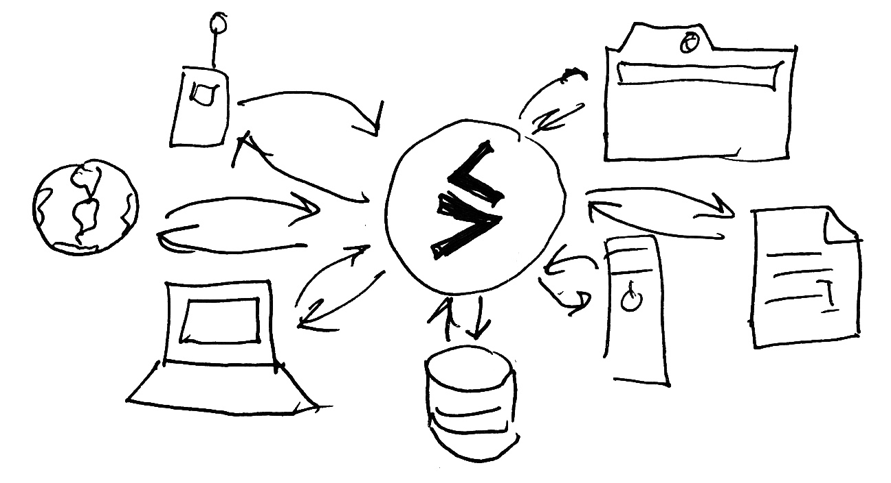

# SwarmDB

First and foremost, SwarmDB is a proof-of-concept key-value RON store.
In SwarmDB, every key is a RON UUID and every value is a RON frame.
SwarmDB is versioned, replicated, offline-ready and it always synchronizes correctly.
SwarmDB provides strong eventual consistency (causal CRDTs).

Technically,  `SwarmDB = RocksDB + RON + RDT`.

The reliance on RocksDB makes SwarmDB embeddable, still able to bear high server-side loads.
Everything that has LevelDB bindings could have SwarmDB bindings too.

Caveat: SwarmDB is not a NoSQL database in the usual meaning.
It is more like a versioned documents store.
SwarmDB has no query language in of the usual kind; it only serves key-value RON queries.

SwarmDB is like `git` for your data, but there are certain differences.
SwarmDB stores structured data (arrays, sets, maps, objects), not just binary blobs.
It provides JSON, text, CSV and other interfaces using mappers, but it is not JSON or CSV.
Inside, it is RON RDTs all the way down.

Again, SwarmDB has a very advanced versioning/sync machinery, but a very rudimentary query language.
It is not a MongoDB killer, but more like a syncable storage engine.

SwarmDB can synchronize in arbitrary topologies, work offline or work in real-time, merge concurrent changes, etc.
On top of SwarmDB one may build:

* a collaborative editor or
* a revision control system or
* a NoSQL database or
* a geo-distributed eventually consistent data cache,
* a shared (decentralized) database,
* a distributed Web project.

SwarmDB itself is a syncable storage engine.

## Documentation

- [Testing](testing/)
- [RON API](api/)

TODO

- [Storage](storage/)
- [Application layer](app/)
- [Tutorials](tutorials/)
- [Swarm.js](swarm.js/)
