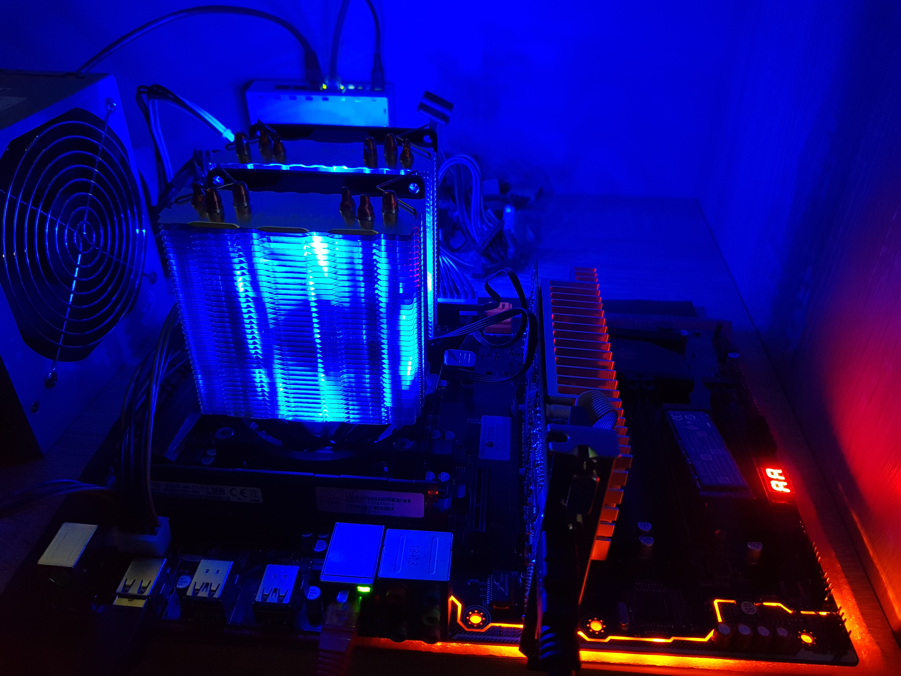

# SwarmDB: testing plan 

Databases are likely the 
[most](https://www.sqlite.org/testing.html)
heavily
[tested](https://news.ycombinator.com/item?id=18442637)
software products.
Quite fortunately, SwarmDB does not do any serious database things
(like custom allocators, thread pools and everything like that).
It merely adds CRDT data structures to RocksDB.
Well, and some other small things.

That's why we only have 4-5 kinds of tests:

## Unit tests at `{ron,rdt,db}/test/`

Unit tests quickly check the freshly written code.
Often, tests are written before the code to solidify the API.
Their tasks are:

1. do basic sanity checks and
2. help with initial debugging.

## ACID (permutation) tests at `rdt/perm-test/`

Replicated Data Types have to be associative, commutative, idempotent.
How do we ensure that? Well, literally.
ACID tests take an input (a sequence of ops) and feed them into a reducer
in arbitrary batches (associativity), arbitrarily reordered (commutativity)
and arbitrarily duplicated (idempotence).
The reducer may not be able to merge every possible subset/permutation,
but: it must handle error conditions correctly!
After each run, we compare the results. They must stay the same.

## Black box tests at `db/bb-test/`

The simplest way of testing a complete system is blackbox testing:
we have a library of inputs and outputs, we feed inputs into the system,
we compare the results.

That is a form of [integration testing](https://en.wikipedia.org/wiki/Integration_testing).

## Stress tests at `db/stress-test/`

The priority of this part is low, as most of the heavylifting is done by RocksDB.
Still, we must ensure that the system may consume high-volume streams of operations,
handle unusually large objects, process larger datasets, etc. 
Importantly, the system must politely reject any above-the-limit inputs.

## Fuzz tests at `{ron,rdt,db}/fuzz-test/`

> Fuzzing or fuzz testing is an automated software testing technique that
> involves providing invalid, unexpected, or random data as inputs to a
> computer program. The program is then monitored for exceptions such as
> crashes, failing built-in code assertions, or potential memory leaks. 

[Fuzz testing](https://en.wikipedia.org/wiki/Fuzzing) is an epic topic.
I started with [AFL](http://lcamtuf.coredump.cx/afl/), although that one seems to be EOLed.
[Clang](https://clang.llvm.org/) has a gorgeous [fuzzer](http://llvm.org/docs/LibFuzzer.html)
which plays along with its equally gorgeous sanitizers.
That produces a nice cumulative effect.

## Continuous integration

Once different testing methods get employed in combination, the effect becomes even more cumulative :)
For 5 types of tests, we have ~30 possible combinations and most of them actually make sense, as far as I can see.
Consider an example:

1. Stress testing generates a large synthetic input;
2. fuzz testing takes that as a starting point, expands code coverage by guided mutations;
3. the resulting dataset could be fed back into stress testing to increase its coverage.

AFAIU, it would be difficult to fuzz and stress at the same time.
That is because stress tests do lots of actual disk writes; they are not stateless.
That kind of a "combo" may be the solution.

Overall, any interesting combos will be added to the continuous itegration scripts.
This old gentleman runs those scripts 24x7. We are not Google, we don't have a cluster yet.
Given the [Amazon EC2 prices](https://aws.amazon.com/ec2/purchasing-options/dedicated-instances/)
(c4.2xlarge, dedicated), it will take this device just *a month* to break even.

