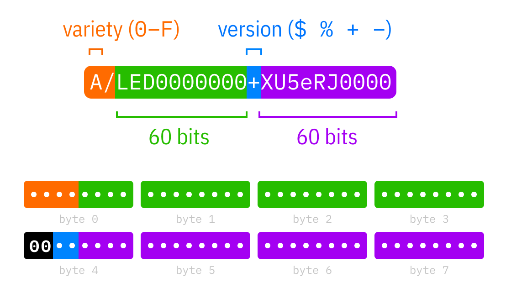

# UUIDs

RON relies heavily on UUIDs to globally and unambigously address every thing it operates with: operations, patches, versions, objects, hashes etc.

RON employs its own UUID flavours and custom efficient serialization. Unlike [RFC 4122](https://tools.ietf.org/html/rfc4122), RON UUIDs:

- can be sorted lexicographically,
- can be efficiently compressed,
- can function as [Lamport/logical](https://en.wikipedia.org/wiki/Lamport_timestamps)/[hybrid](https://muratbuffalo.blogspot.com/2014/07/hybrid-logical-clocks.html) timestamps,
- can represent human-friendly string constants.

RON UUIDs are serialized as a pair of 64-bit integers encoded with custom base64 encoding:



The bit layout is semi-compatible with [RFC 4122](https://tools.ietf.org/html/rfc4122) (0 variant, NCS backward compatibility).
Third and fourth bits of 9th byte are used to encode version (blue color), four most significant bits of 1st byte are used to encode variety (orange color).

## Versions

Two <span style="background-color: #1787FA; color: white; padding: 0 8px; border-radius: 4px; ">version bits</span> are encoded using `$`, `%`, `+` or `-` as separator:

<ul class="nobullet">
  <li><code>$</code> for <code>00</code>: human readable names,</li>
  <li><code>%</code> for <code>01</code>: numbers and hashes,</li>
  <li><code>+</code> for <code>10</code>: events (Lamport timestamp, and origin),</li>
  <li><code>-</code> for <code>11</code>: derived events (same as event).</li>
</ul>

## Varieties

Four <span style="background-color: #FD6B21; color: white; padding: 0 8px; border-radius: 4px; ">variety bits</span> are encoded using single hex digit `0`..`F` followed by a slash `/`.

Variety flavour is defined by version.

Variety of zero `0` can be omitted.

### Varieties for version `$` (names):

<ul class="nobullet">
  <li><code>0000</code>: transcendental/hardcoded name (<code>lww</code>, <code>rga</code>) or a scoped name (<code>myvar$gritzko</code>),</li>
  <li><code>0001</code>: ISBN (<code>1/978$1400075997</code>,</li>
  <li><code>0011</code>: EAN-13 bar code (<code>3/4006381$333931</code>,</li>
  <li><code>0100</code>: SI units (<code>4/m</code>, <code>4/kg</code>,</li>
  <li><code>0101</code>: zip codes (<code>5/2628CD$NL</code>, <code>5/620078$RU</code>,</li>
  <li><code>1010</code>: IATA airport code (<code>A/LED</code>,</li>
  <li><code>1011</code>: ticker name (<code>B/GOOG$NASDAQ</code>,</li>
  <li><code>1100</code>: ISO 4217 currency code (<code>C/USD</code>, <code>C/GBP</code>,</li>
  <li><code>1101</code>: short DNS name (<code>D/google$com</code>,</li>
  <li><code>1110</code>: E.164 intl phone num (<code>E/7999$5631415</code>,</li>
  <li><code>1111</code>: ISO 3166 country code (<code>F/RU</code>, <code>F/FRA</code>...).</li>
</ul>

### Varieties for version `%` (numbers and hashes):

<ul class="nobullet">
  <li><code>0000</code>..<code>0011</code>: Decimal index (up to <code>9999999999%</code>, also 2D indices <code>4%5</code>),</li>
  <li><code>0100</code>: SHA-2, plain chunk hash, first 120 bits,</li>
  <li><code>0101</code>: SHA-3, plain chunk hash,</li>
  <li><code>0110</code>: SHA-2 based RFC 7574 Merkle hash,</li>
  <li><code>0111</code>: SHA-3 based RFC 7574 Merkle hash,</li>
  <li><code>1000</code>..<code>1011</code>: Random number (<code>A/k3R9w_2F8w%Le~6dDScsw</code>),</li>
  <li><code>1100</code>..<code>1111</code>: Crypto id, public key fingerprint.</li>
</ul>

### Varieties for versions `+` and `-` (events).

Timestamp type:

<ul class="nobullet">
  <li><code>00__</code>: Base64 calendar (<code>MMDHmSsnn</code>),</li>
  <li><code>01__</code>: Logical (<code>40000000001</code>),</li>
  <li><code>10__</code>: Epoch (RFC 4122 epoch, 100ns since 1582),</li>
</ul>

bitwise and with replica id assignment rule:

<ul class="nobullet">
  <li><code>__00</code>: trie-forked,</li>
  <li><code>__01</code>: crypto-forked,</li>
  <li><code>__10</code>: record-forked,</li>
  <li><code>__11</code>: application-specific.</li>
</ul>

## UUID compression

Most of RON UUIDs can be efficiently compressed by only encoding highest significant bits.

Base 64×64 tailing zeroes can be omitted:

```
A/LED0000000+0000000000 = A/LED+0
A/LED0000000$123 = A/LED$123
```

If version is `$` and second component is zero, it can be fully omitted:

```
A/LED0000000$0000000000 = A/LED$0 = A/LED
```

If variety is `0`, it can be omitted as well:

```
0/lww0000000$0000000000 = lww0000000$0000000000 = lww$0 = lww
```

## See also

Integer encoding scheme: [Base 64×64](base64x64/).

Replica [assignments rules](replicas/).

Calendar-aware [timestamp encoding](timestamps/).
